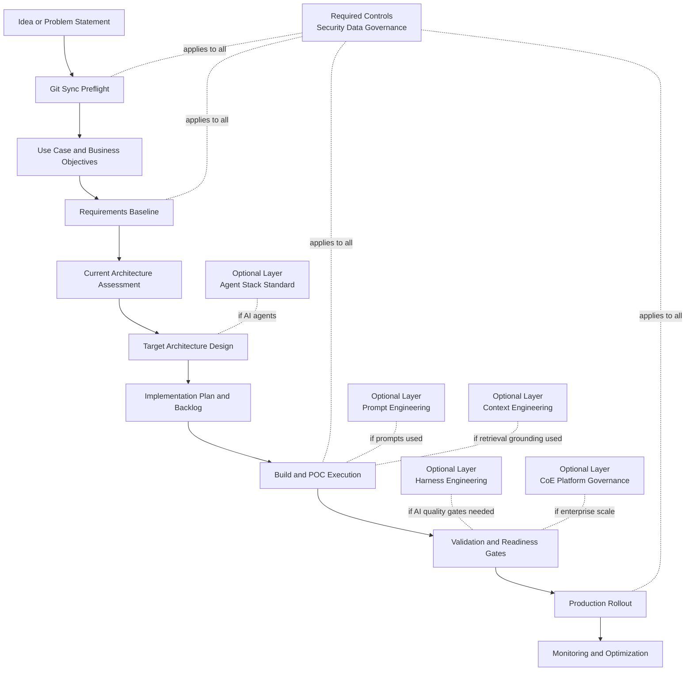

# Software Architecture Blueprint (Required vs Optional)

This blueprint defines what every software project in this repository must have
and what can be added based on complexity, scale, or risk.

## Required Building Blocks

1. Source Control Hygiene
- Git synchronization preflight before changes.
- Branch status clarity before implementation.

2. Problem Framing
- Defined use case and business objectives.
- Identified stakeholders and success criteria.

3. Requirements Baseline
- Business requirements.
- Functional requirements.
- System requirements.
- Data requirements.

4. Architecture Baseline
- Current-state assessment.
- Target architecture design.
- Production gap analysis.

5. Delivery Plan
- Implementation plan.
- Milestones.
- Solution tracks.
- Prioritized backlog.

6. Quality and Risk Controls
- KPI definition.
- Risk assessment.
- Readiness assessment.
- POC validation.

7. Documentation
- Use case document.
- Architecture document.
- Technical specifications.

8. Security and Data Handling
- DefaultAzureCredential or Managed Identity by default.
- Secrets from environment variables only.
- No PII in repository content.
- Persistent data in approved database, or dedicated data folder when local files are necessary.

## Optional Building Blocks

1. Agent Stack Constraints
- Required only when building agent-based software.
- Streamlit UI, Microsoft Agent Framework orchestration, and Foundry Prompt or Hosted agent.

2. Center of Excellence Governance Layer
- Required for enterprise-wide platform enforcement.
- Optional for isolated local experiments.

3. Prompt Engineering Guardrails
- Required when prompts are part of runtime behavior.
- Optional for non-AI software.

4. Context Engineering Guardrails
- Required when retrieval/grounding context affects outputs.
- Optional for deterministic workflows with no model context.

5. Harness Engineering and Evaluation Pipeline
- Required for AI production quality gates.
- Optional for early exploratory prototyping.

6. Monitoring and Optimization Cadence
- Required for production services.
- Optional in throwaway prototypes.

## Architecture Diagram

## Skill Mapping To The Blueprint

| Blueprint Stage | Required Skills |
|---|---|
| Git and preflight | [git-sync-first](../skills/git-sync-first/SKILL.md) |
| Use case and strategy | [define-use-case](../skills/define-use-case/SKILL.md), [prioritize-use-cases](../skills/prioritize-use-cases/SKILL.md), [identify-stakeholders](../skills/identify-stakeholders/SKILL.md), [define-business-objectives](../skills/define-business-objectives/SKILL.md) |
| Modeling | [create-use-case-story](../skills/create-use-case-story/SKILL.md), [define-user-stories](../skills/define-user-stories/SKILL.md), [define-workflows](../skills/define-workflows/SKILL.md), [define-success-criteria](../skills/define-success-criteria/SKILL.md) |
| Requirements | [generate-business-requirements](../skills/generate-business-requirements/SKILL.md), [generate-functional-requirements](../skills/generate-functional-requirements/SKILL.md), [generate-system-requirements](../skills/generate-system-requirements/SKILL.md), [define-data-requirements](../skills/define-data-requirements/SKILL.md) |
| Architecture | [assess-current-architecture](../skills/assess-current-architecture/SKILL.md), [design-target-architecture](../skills/design-target-architecture/SKILL.md), [generate-architecture-diagram](../skills/generate-architecture-diagram/SKILL.md), [identify-production-gaps](../skills/identify-production-gaps/SKILL.md) |
| Planning | [create-implementation-plan](../skills/create-implementation-plan/SKILL.md), [define-milestones](../skills/define-milestones/SKILL.md), [define-solution-tracks](../skills/define-solution-tracks/SKILL.md), [create-backlog](../skills/create-backlog/SKILL.md) |
| Execution and optimization | [execute-poc](../skills/execute-poc/SKILL.md), [collect-feedback](../skills/collect-feedback/SKILL.md), [optimize-solution](../skills/optimize-solution/SKILL.md), [monitor-performance](../skills/monitor-performance/SKILL.md) |
| Validation and readiness | [perform-readiness-assessment](../skills/perform-readiness-assessment/SKILL.md), [define-kpis](../skills/define-kpis/SKILL.md), [risk-assessment](../skills/risk-assessment/SKILL.md), [validate-poc](../skills/validate-poc/SKILL.md) |
| Documentation | [create-use-case-document](../skills/create-use-case-document/SKILL.md), [create-architecture-document](../skills/create-architecture-document/SKILL.md), [generate-technical-specs](../skills/generate-technical-specs/SKILL.md), [maintain-docs-repository](../skills/maintain-docs-repository/SKILL.md) |

## Optional Skill Layers For AI-Heavy Projects

1. [approved-agent-stack](../skills/approved-agent-stack/SKILL.md)
2. [prompt-engineering-best-practices](../skills/prompt-engineering-best-practices/SKILL.md)
3. [context-engineering-best-practices](../skills/context-engineering-best-practices/SKILL.md)
4. [harness-engineering-best-practices](../skills/harness-engineering-best-practices/SKILL.md)
5. [center-of-excellence-platform](../skills/center-of-excellence-platform/SKILL.md)

## Implementation Checklist For New Teams

1. Confirm project scope and business objective.
2. Complete required stages in order from strategy through readiness.
3. Add optional layers only when applicable to architecture and risk profile.
4. Keep all artifacts versioned in this repository.
5. Re-run validation and documentation updates before each release.
